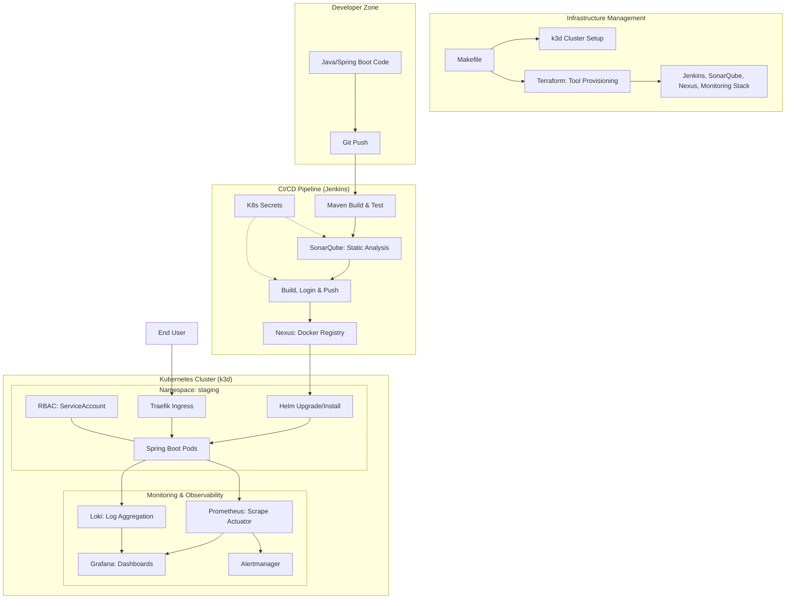
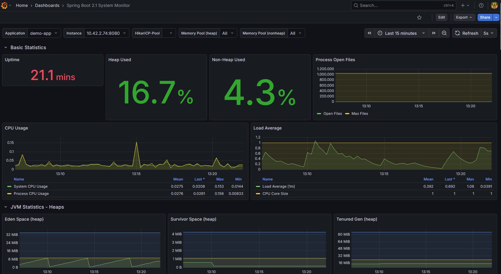

# DevOps Observability Platform

A platform for automating deployment and monitoring of microservices on Kubernetes.

## Architecture & Process Flow



### Request & Artifact Flow Description
1.  **Infrastructure Provisioning:** The platform is initialized via a **Makefile** which scaffolds the **k3d cluster** and triggers **Terraform** to deploy the DevOps and Observability tools.
2.  **Coding:** The developer pushes code to the repository.
3.  **CI/CD Orchestration:** Jenkins detects changes, builds the JAR, and runs unit tests using Maven.
4.  **Security & Quality:** Jenkins retrieves credentials from **Kubernetes Secrets** to perform a SonarQube scan and authenticate with the Docker registry. Pipeline enforces **SonarQube Quality Gates**.
5.  **Artifact Management:** The Docker image is built and pushed to the **Nexus Docker Registry**.
6.  **Deployment (CD):** Jenkins deploys the application to the `staging` namespace using **Helm**, pulling the image from Nexus.
7.  **Access Control:** The application runs with a dedicated **ServiceAccount** and restricted **RBAC** roles.

### Observability & Alerting
Prometheus automatically discovers Pods and scrapes metrics via Spring Boot Actuator. 
*   **Logging:** Loki collects logs from all pods via Promtail (DaemonSet), accessible in Grafana.
*   **Alerting:** Custom rules for health and latency are evaluated by Prometheus and sent to Alertmanager.
*   **Visualization:** Grafana is pre-configured with Prometheus and Loki datasources and a custom Spring Boot dashboard.




## Pipeline Features
The project includes a multi-stage `Jenkinsfile` that automates:
1.  **Checkout:** Retrieves the latest code.
2.  **Build & Test:** Executes Maven build and JUnit tests.
3.  **SonarQube Scan:** Performs static code analysis using secure credentials.
4.  **Dockerization:** Builds and tags Docker images.
5.  **Deployment:** Deploys to the `staging` namespace using Helm.

## Security & Compliance
*   **Secrets Management:** No hardcoded passwords. Credentials for SonarQube and Nexus are managed via Kubernetes Secrets and injected into Jenkins.
*   **RBAC (Role-Based Access Control):** Least privilege principle applied via `rbac.tf`.
*   **Infrastructure as Code:** All resources are version-controlled and managed via Terraform.

## Testing
Unit tests are located in `app/src/test`. Run them locally using:
```bash
cd app && mvn test
```

### Requirements
- Docker
- k3d (installed via `make install-deps`)
- Terraform (installed via `make install-deps`)
- Helm
- kubectl

### Infrastructure Setup
```bash
make install-deps
make cluster-up
make tools-init
make tools-up
```

## Service Access (requires port-forward)

### Application (Staging)
- **URL:** [http://localhost/api/hello](http://localhost/api/hello)
- **Direct Access:** `kubectl port-forward svc/demo-app -n staging 8080:8080`

### Jenkins
- **URL:** http://localhost:8080
- **Command:** `kubectl port-forward svc/jenkins -n jenkins 8080:8080`
- **Credentials:** admin / (see secrets)

### SonarQube
- **URL:** http://localhost:9000
- **Command:** `kubectl port-forward svc/sonarqube-sonarqube -n sonarqube 9000:9000`
- **Credentials:** admin / admin

### Grafana
- **URL:** http://localhost:3000
- **Command:** `kubectl port-forward svc/grafana -n monitoring 3000:80`
- **Credentials:** admin / admin

### Nexus
- **URL:** http://localhost:8081
- **Command:** `kubectl port-forward svc/nexus-sonatype-nexus -n nexus 8081:8080`
- **Credentials:** admin / admin123

### SonarQube
- **URL:** http://localhost:9000 (requires port-forward)
- **Command:** `kubectl port-forward svc/sonarqube-sonarqube 9000:9000 -n sonarqube`
- **Credentials:** Managed via K8s Secrets (`sonarqube-creds`)

### Nexus
- **URL:** http://localhost:8081 (requires port-forward)
- **Command:** `kubectl port-forward svc/nexus-sonatype-nexus 8081:8081 -n nexus`
- **Credentials:** Managed via K8s Secrets (`nexus-creds`)

### Prometheus & Grafana
- **Prometheus:** `kubectl port-forward svc/prometheus-server 9090:80 -n monitoring`
- **Grafana:** [http://localhost:3000](http://localhost:3000) (admin / admin)
- **Grafana Command:** `kubectl port-forward svc/grafana 3000:80 -n monitoring`
