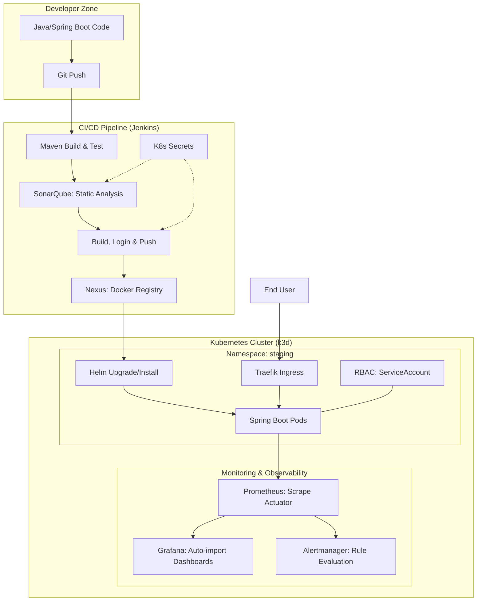

# DevOps Observability Platform

A platform for automating deployment and monitoring of microservices on Kubernetes.

## Architecture & Process Flow



### Request & Artifact Flow Description
1.  **Coding:** The developer pushes code to the repository.
2.  **CI/CD Orchestration:** Jenkins detects changes, builds the JAR, and runs unit tests using Maven.
3.  **Security & Quality:** Jenkins retrieves credentials from **Kubernetes Secrets** to perform a SonarQube scan and authenticate with the Docker registry.
4.  **Artifact Management:** The Docker image is built, scanned for vulnerabilities (Trivy), and pushed to the **Nexus Docker Registry**.
5.  **Deployment (CD):** Jenkins deploys the application to the `staging` namespace using **Helm**, pulling the image from the local Nexus.
6.  **Access Control:** The application runs with a dedicated **ServiceAccount** and restricted **RBAC** roles (least privilege).

### Observability & Alerting
Prometheus automatically discovers Pods and scrapes metrics via Spring Boot Actuator. 
*   **Alerting:** Custom rules for health and latency are evaluated by Prometheus and sent to Alertmanager.
*   **Visualization:** Grafana is pre-configured with a Prometheus datasource and automatically imports the **Spring Boot Observability** dashboard.
*   **Access:** Defined in `monitoring/prometheus/alert_rules.yml` and integrated via Helm values.


## Pipeline Features
The project includes a multi-stage `Jenkinsfile` that automates:
1.  **Checkout:** Retrieves the latest code.
2.  **Build & Test:** Executes Maven build and JUnit tests.
3.  **SonarQube Scan:** Performs static code analysis using secure credentials.
4.  **Dockerization:** Builds and tags Docker images with vulnerability scanning (Trivy).
5.  **Deployment:** Deploys to the `staging` namespace using Helm with Ingress and RBAC support.

## Security & Compliance
*   **Secrets Management:** No hardcoded passwords. Credentials for SonarQube and Nexus are managed via Kubernetes Secrets and injected at runtime.
*   **RBAC (Role-Based Access Control):** Least privilege principle applied to the application namespace.
*   **Image Scanning:** All images are scanned for vulnerabilities before deployment.

## Testing
Unit tests are located in `app/src/test`. Run them locally using:
```bash
cd app && mvn test
```
### Requirements
- Docker
- k3d (installed via `make install-deps`)
- Helm
- kubectl

### Infrastructure Setup
```bash
make install-deps
make cluster-up
make tools-init
make tools-up
```

## Service Access

### Application (Staging)
- **URL:** [http://localhost/api/hello](http://localhost/api/hello)
- **Note:** Access via port 80 (standard HTTP) mapped by k3d.

### Jenkins
- **URL:** http://localhost:8080 (requires port-forward)
- **Command:** `kubectl port-forward svc/jenkins 8080:8080 -n jenkins`
- **Password:** `kubectl exec -it svc/jenkins -n jenkins -c jenkins -- cat /run/secrets/additional/chart-admin-password`

### SonarQube
- **URL:** http://localhost:9000 (requires port-forward)
- **Command:** `kubectl port-forward svc/sonarqube-sonarqube 9000:9000 -n sonarqube`
- **Credentials:** Managed via K8s Secrets (`sonarqube-creds`)

### Nexus
- **URL:** http://localhost:8081 (requires port-forward)
- **Command:** `kubectl port-forward svc/nexus-sonatype-nexus 8081:8081 -n nexus`
- **Credentials:** Managed via K8s Secrets (`nexus-creds`)

### Prometheus & Grafana
- **Prometheus:** `kubectl port-forward svc/prometheus-server 9090:80 -n monitoring`
- **Grafana:** [http://localhost:3000](http://localhost:3000) (admin / admin)
- **Grafana Command:** `kubectl port-forward svc/grafana 3000:80 -n monitoring`
