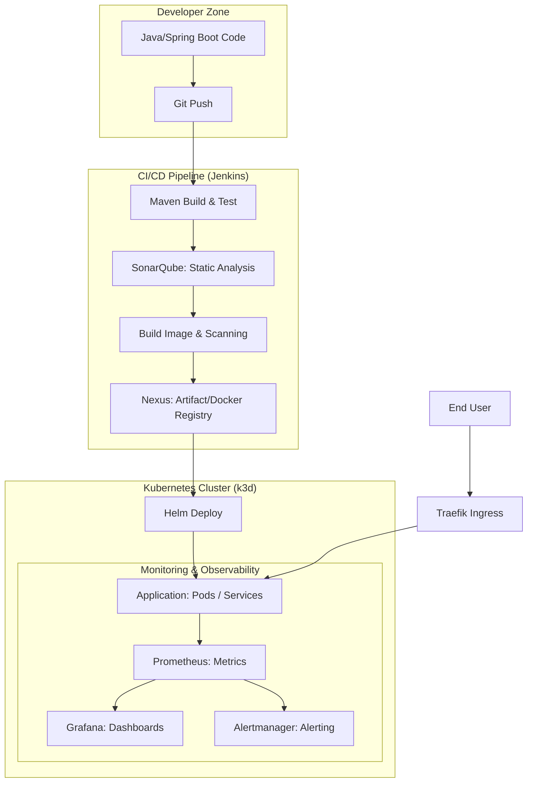

# DevOps Observability Platform

A platform for automating deployment and monitoring of microservices on Kubernetes.

## Architecture & Process Flow



### Request & Artifact Flow Description
1.  **Coding:** The developer pushes code to the repository.
2.  **CI/CD Orchestration:** Jenkins detects changes, builds the artifact (JAR), runs unit tests, and sends reports to SonarQube.
3.  **Quality Assurance:** SonarQube checks the Quality Gate. If successful, Jenkins builds the Docker image.
4.  **Artifact Management:** The Docker image is tagged and pushed to the private registry in Nexus.
### Deployment (CD)
Jenkins updates the deployment on Kubernetes using Helm.

### Observability & Alerting
Prometheus automatically discovers new Pods and scrapes metrics (JVM, latency). Grafana visualizes this data, and Alertmanager monitors critical thresholds to send notifications.
*   **Alert Rules:** Defined in `monitoring/prometheus/alert_rules.yml`.

## Pipeline Features
The project includes a multi-stage `Jenkinsfile` that automates:
1.  **Checkout:** Retrieves the latest code.
2.  **Build & Test:** Executes Maven build and JUnit tests.
3.  **SonarQube Scan:** Performs static code analysis.
4.  **Dockerization:** Builds and tags Docker images.
5.  **Deployment:** Deploys the application to the `staging` namespace using Helm.

## Testing
Unit tests are located in `app/src/test`. Run them locally using:
```bash
cd app && mvn test
```
### Requirements
- Docker
- k3d (will be installed via `make install-deps`)
- Helm
- kubectl

### Infrastructure Setup
```bash
make install-deps
make cluster-up
make tools-init
make tools-up
```

## Service Access

### Jenkins
- **URL:** http://localhost:8080 (requires port-forward)
- **Command:** `kubectl port-forward svc/jenkins 8080:8080 -n jenkins`
- **Password:** `kubectl exec -it svc/jenkins -n jenkins -c jenkins -- cat /run/secrets/additional/chart-admin-password`

### SonarQube
- **URL:** http://localhost:9000 (requires port-forward)
- **Command:** `kubectl port-forward svc/sonarqube-sonarqube 9000:9000 -n sonarqube`
- **Credentials:** admin / admin

### Nexus
- **URL:** http://localhost:8081 (requires port-forward)
- **Command:** `kubectl port-forward svc/nexus-sonatype-nexus 8081:8081 -n nexus`
- **Credentials:** admin / admin123

### Prometheus
- **URL:** http://localhost:9090 (requires port-forward)
- **Command:** `kubectl port-forward svc/prometheus-server 9090:80 -n monitoring`

### Grafana
- **URL:** http://localhost:3000 (requires port-forward)
- **Command:** `kubectl port-forward svc/grafana 3000:80 -n monitoring`
- **Credentials:** admin / admin
